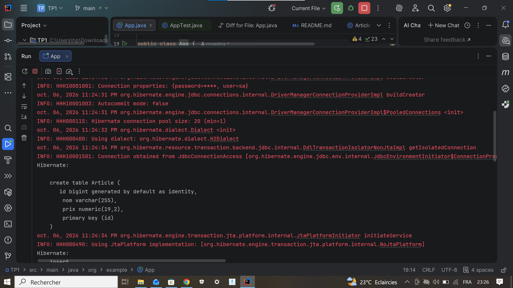
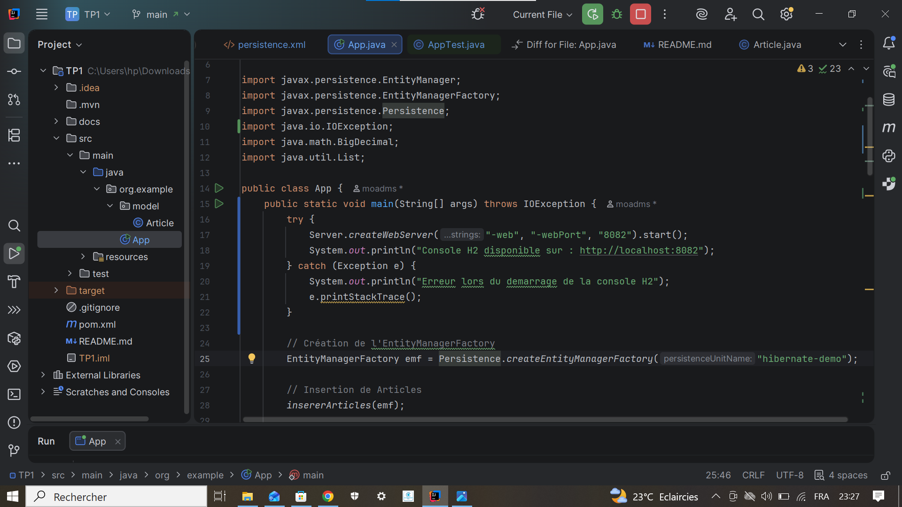
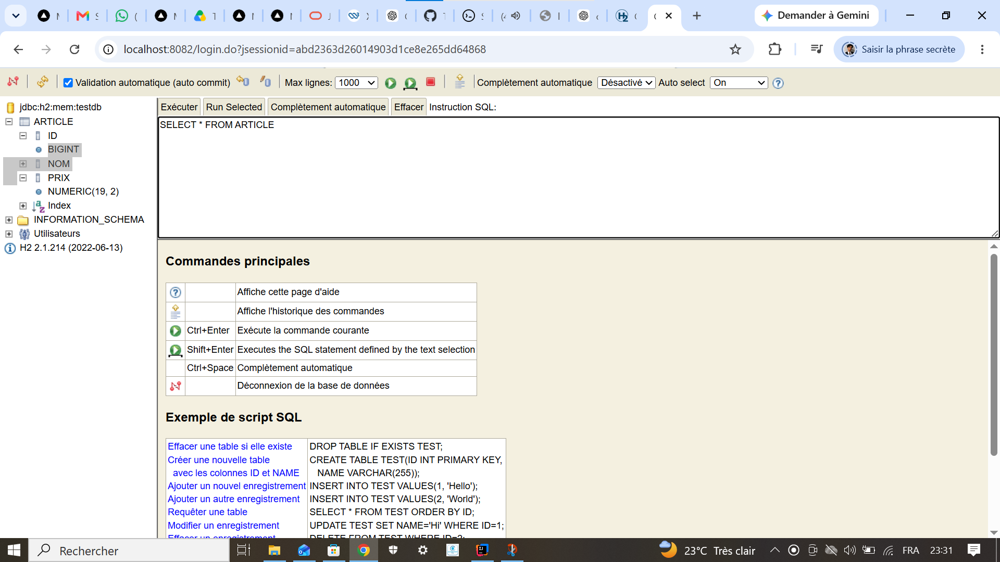
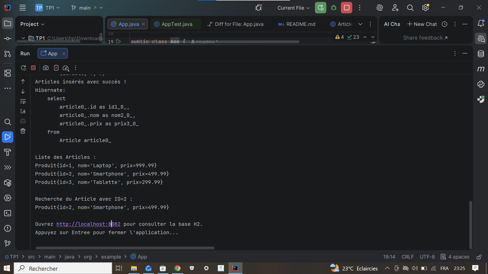
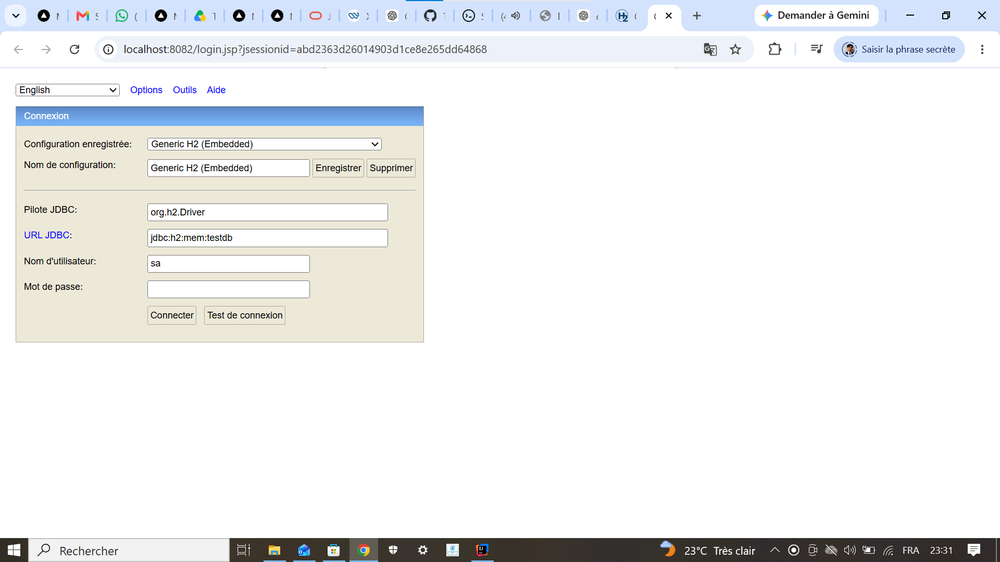
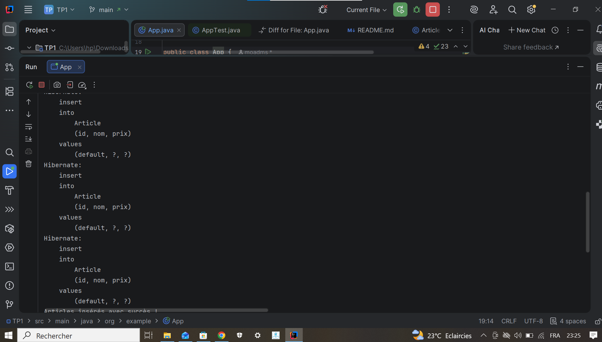

# TP1 Java - Hibernate JPA

Dans ce TP, j'ai travaille avec Java, Hibernate, JPA et la base de donnees H2.
Le but est de creer une entite `Article`, inserer des donnees, puis verifier le resultat avec la console Web H2.

## Modification de la configuration Hibernate

J'ai remplace `create-drop` par `update` dans le fichier `persistence.xml`.
Avec `update`, Hibernate garde la structure de la base pendant que l'application reste lancee.



## Lancement de la console H2

J'ai ajoute le demarrage de la console H2 dans la classe principale avec le port `8082`.
Comme ca, je peux ouvrir la base dans le navigateur.



## Connexion a la base H2

Pour se connecter, j'utilise l'adresse `http://localhost:8082`.
Les informations de connexion sont :

- Driver Class : `org.h2.Driver`
- JDBC URL : `jdbc:h2:mem:testdb`
- User Name : `sa`
- Password : vide



## Table generee par Hibernate

Apres l'execution, Hibernate cree la table `ARTICLE`.
Cette table contient les colonnes de l'entite Java.



## Verification avec SQL

J'ai execute une requete SQL pour afficher les donnees inserees dans la table.

```sql
SELECT * FROM ARTICLE;
```



## Resultat final

Le resultat montre que les articles sont bien inseres dans la base H2.
La console permet donc de verifier facilement le contenu de la base.


