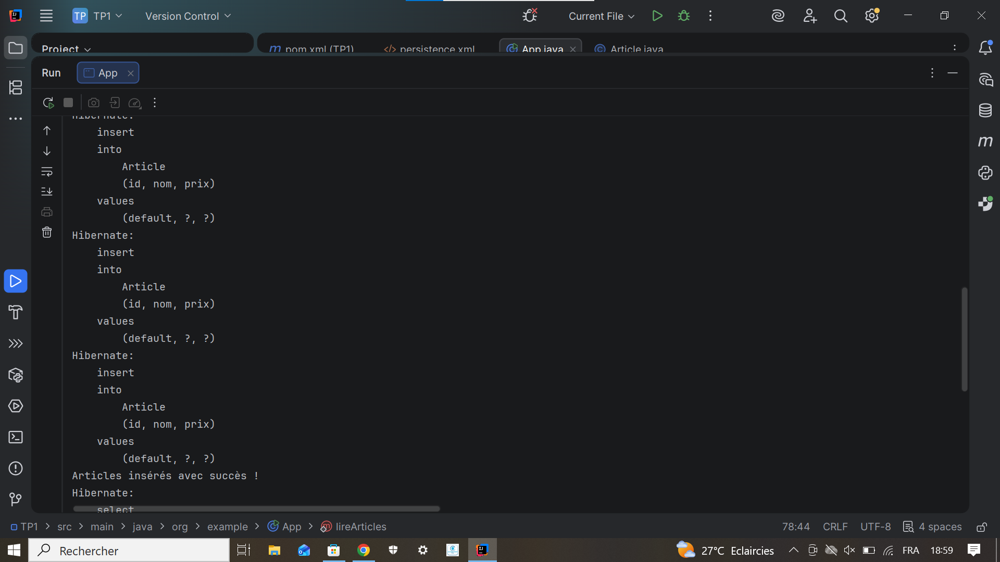

# TP1 Java - Hibernate JPA

Ce projet est un petit TP Java qui utilise Hibernate avec JPA et une base de donnees H2 en memoire.
Le programme ajoute quelques articles dans la base, puis il affiche la liste des articles dans la console.

## Execution du programme

Cette capture montre le lancement du projet depuis IntelliJ IDEA. On voit que Hibernate demarre correctement et cree la table `Article`.

## Resultat obtenu

Cette capture montre le resultat final dans la console. Les articles sont bien inseres, puis recuperes avec une requete JPQL.

